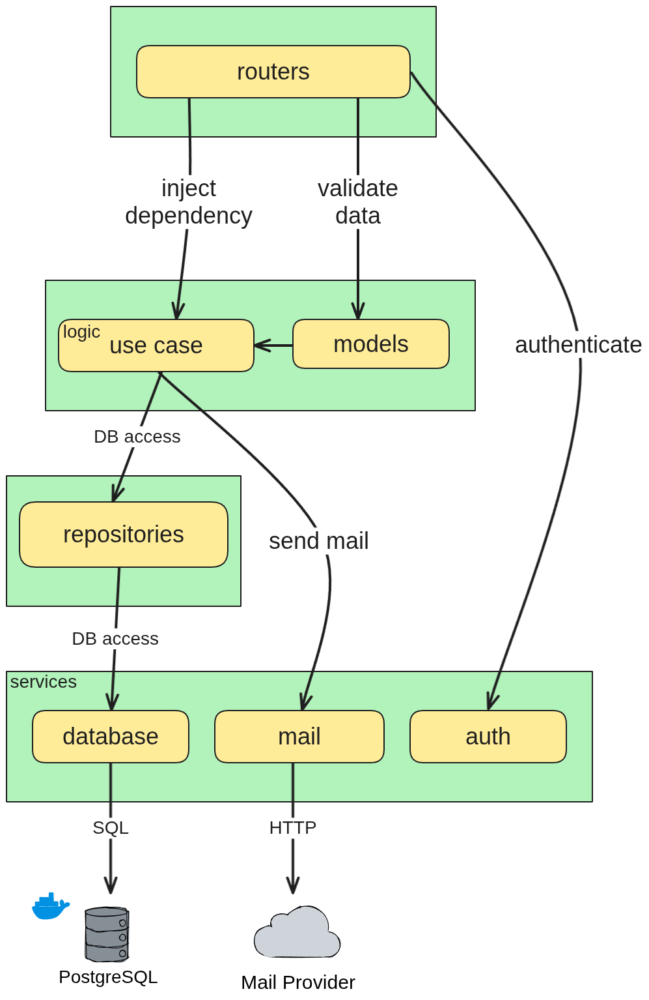

## Building a user registration API

**Run the project**

```bash
docker-compose up -d
docker logs user_registration_api -n 200 -f
```

API : `http://localhost:8000/api`

Documentation : `http://localhost:8000/docs`

PgAdmin (optional) : `http://localhost:5050`

**Test the routes**
- Use Insomnia, Postman, or else.
- Use the small interface hosted at `http://localhost:8000` and open browser inspector to take a look a the API calls.
- Run the automated tests using :
	- `docker exec user_registration_api python3 -m pytest src/use_cases` unit tests
	- `docker exec user_registration_api python3 -m pytest src/routers` integration tests (router/auth)
*unit tests fake bcrypt hashing for faster execution, integration tests do not (slower).*

# Architecture



### Stack
- Python
- FastAPI
- PostgreSQL
- Docker

### Containers
- api -> run FastAPI
- database -> run PgSQL server
- pgadmin (optional) -> database UI

### Pip packages used
- fastapi
- psycopg
- pytest
- bcrypt

## Code organisation

```
├── main.py
└── src
    ├── models
    ├── repository
    ├── routers
    ├── services
    └── use_cases
```

**models** : Data validation and parsing

**repositories** : Database interactions (queries & transactions)

**routers** : API endpoint definitions and request/response handling

**services** : Application services (authentication, mail adapter, database handler)

**use_cases** : Business logic handlers

## Implementation details

### Authentication
Before a user is inserted into DB, email and password undergoes a validation check, password is hashed using `bcrypt` and user is persisted into DB. *I wasn't sure if using a cryptography lib is allowed but I assumed I didn't have to write my own hashing function.*

Authenticated requests requires `BASIC AUTH` to function:
**headers**
```json
{ "Authorization": "Basic base64(email:password)" }
```
The authorization header is parsed by a custom dependency `auth._parse_basic_auth` -*no magic*- and the actual check is done by `auth._get_authenticated_user`. Any route implementing `Depends(auth.get_active_user)` or `Depends(auth.get_inactive_user)` will raise if invalid or missing authentication credentials.

### Activation code
Users have `activated=False` by default. During user creation, an entry on table **activation_code** is persisted, this entry is linked to `users` table through a foreign key and possess a random 4 digits code and a creation date.
*The **activation_code** table should be regularly be cleaned with a CRON/TTL but this is certainly out of scope.*

A mail or console log is sent, containing the code. I've used an `Adapter Pattern` so that both ways are easily interchangeable.
*By default, console logs is activated. To test the third-party mail request, use a webhook provider like [https://webhook.site/]() and follow the instruction in `services/mail.py`*.

### Activation code validation
Activation code validation is done with a single SQL requests that checks if a given code exists for a specific user and that this code was created less than a minute ago, if such an entry is found, user's `activated` column gets updated, otherwise, an error is raised.

### Database
`services/database.py` provides DB connection and initialization. It checks if connection to database is open and create the two tables required for the project. It also provides the dependency injector `get_db`. *I've opted for a pool connection injector instead of an atomic connection for a more prod-ready setup.*
Database is persisted through a volume mounted on `./db_storage`.
Beside the initialization sequence, all SQL requests are found in `repositories/*`.

### Known limitations and improvement
There are a few points I wasn't sure if in scope or not, namely:
- rate limit
- activation code table cleanup
- password hashing (I used `bcrypt` package)

Also, for sake of simplicity, my router integration tests do not mock use case execution (as they should in a real project).